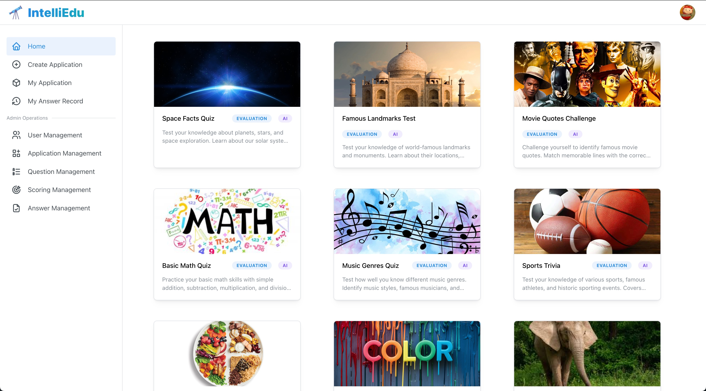
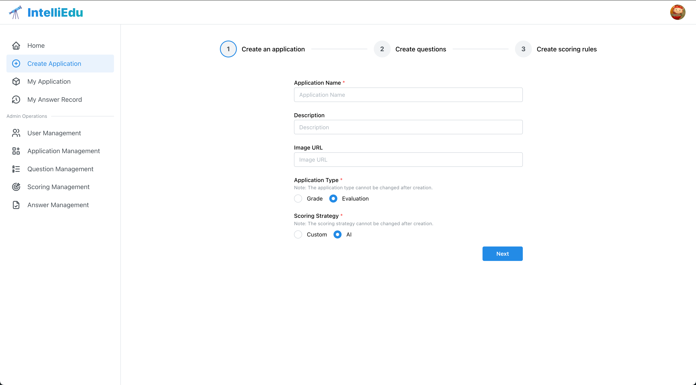
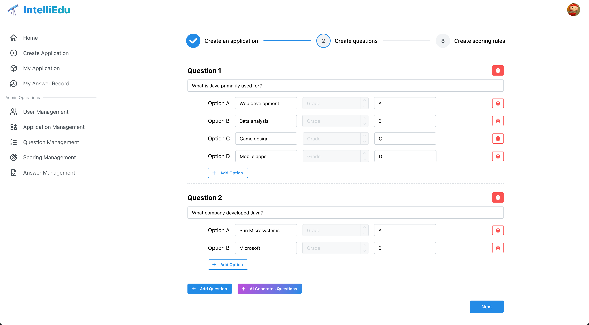
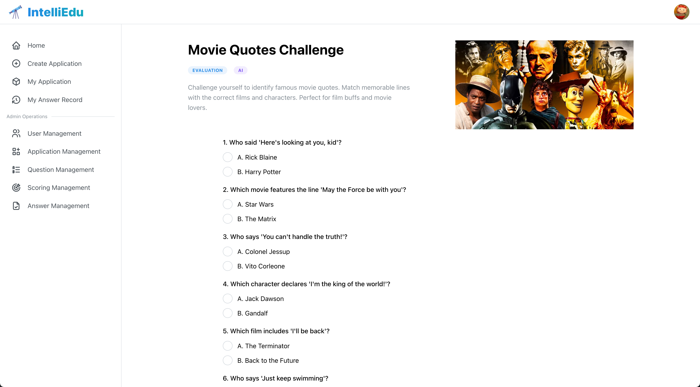
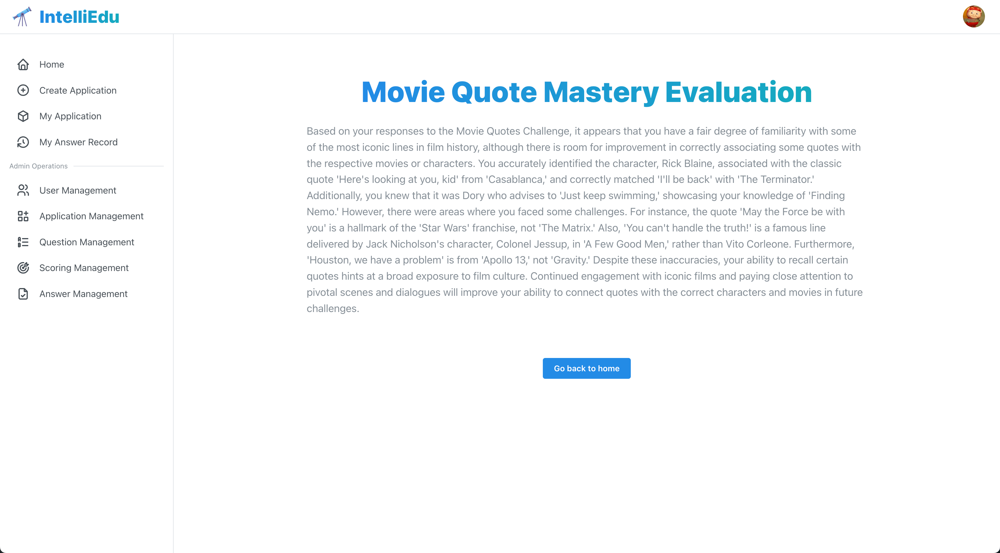
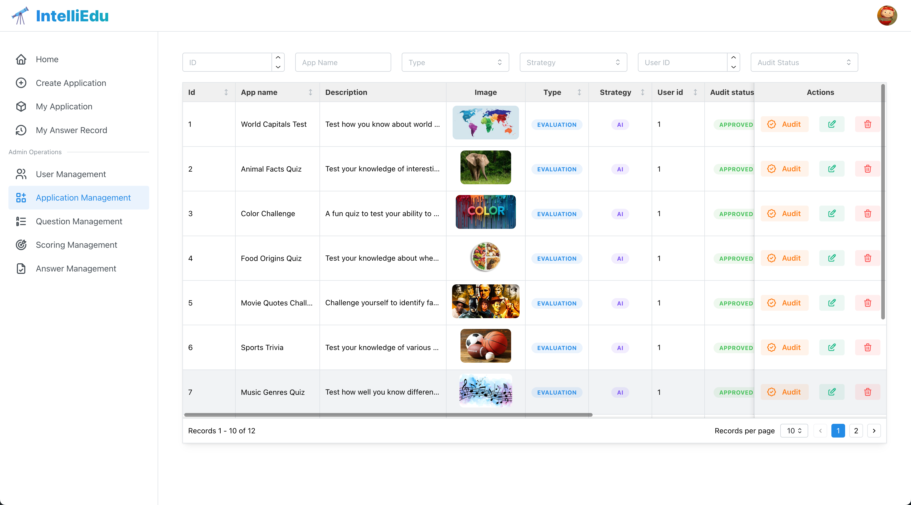
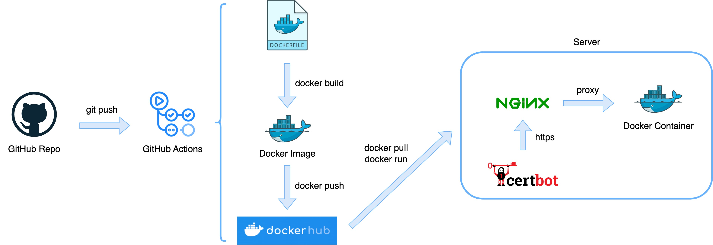

## Introduction

An Intelligent Quiz Platform built with Spring Boot and OpenAI API. Leverages Redis for high-performance caching and features AI-powered question generation, online quiz taking, and automated scoring. Implements comprehensive administrative controls including user management, application configuration, and question administration capabilities.

## Technical Highlights

1. Integrated OpenAI API for intelligent question generation and automated scoring, enhancing assessment efficiency.
2. Implemented flexible scoring mechanisms using Strategy Pattern, allowing easy extension of scoring algorithms.
3. Optimized question generation performance by leveraging OpenAI Streaming API and Server-Sent Events (SSE) for real-time question delivery.
4. Enhanced system performance with Caffeine for frequently accessed scoring results caching and Redisson distributed locks to prevent cache breakdown in high-concurrency scenarios.
5. Employed Redisson RateLimiter for precise control of SSE request flow, ensuring system stability under high load.

## Preview

Home



Create an application



Create Questions



Take Quiz



AI Scoring Result



Application management



## Development Guide

### Prerequisites

- JDK 1.8
- Spring Boot 2.7.6
- MySQL 8.3.0
- Redis 7.2.4

### Setup Steps

1. **MySQL**
    - Install MySQL (or use AWS RDS)
    - Run scripts from `sql` directory

2. **Redis**
    - Install Redis (or use Digital Ocean Database Caching)
    - Note: AWS ElastiCache not recommended (private VPC limitations)

3. **Environment Variable**  
   Configure in `application.yml`:
    - MySQL connection
    - Redis connection
    - OpenAI token

## Deployment Guide

You can follow the diagram below to configure and deploy the application on your server:



Note:

* Nginx is used to enable HTTPS.
* To enable Server-Sent Events (SSE) for the AI question generation feature, add the following configuration to your Nginx server, otherwise SSE will not work properly:

```
   location /api/application/question/ai_generate/sse {
       proxy_pass http://localhost:8081;
       proxy_set_header Host $host;
       proxy_set_header X-Real-IP $remote_addr;
       proxy_set_header X-Forwarded-For $proxy_add_x_forwarded_for;
       proxy_set_header X-Forwarded-Proto $scheme;
   
       # disable buffering and caching
       proxy_buffering off;
       proxy_cache off;
   
       # set appropriate response headers
       add_header Content-Type text/event-stream;
       add_header Cache-Control no-cache;
       add_header Connection keep-alive;
       keepalive_timeout 60;
   }
```
